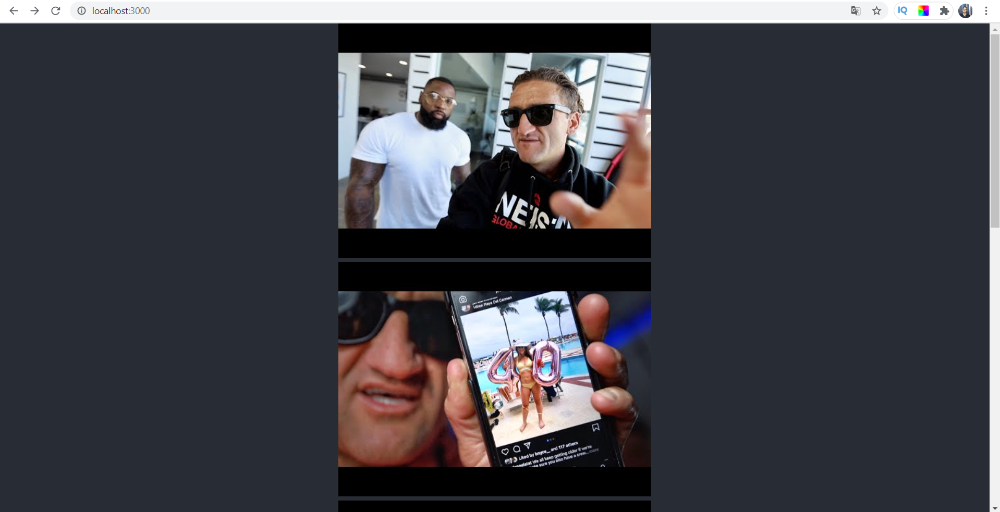

# React + Node

Nesse mini-projeto foi desenvolvida uma API para vídeos do Youtube com Node. Essa API é consumida pelo React que mostra os vídeos na tela.

---

## Node.Js

* Foi criada uma requisição do tipo GET para criar a API;
* Em seguida foi utilizado o DOTENV para diferenciar o ambiente de desenvolvimento do de produção;
* No package.json foi criado scripts para rodar tanto o node quanto o react ao mesmo tempo. Foi utilizado o Concurrently nessa etapa.

---

## React

* A ponte entre o Node e o React foi feita através do fetch no UseEffect;
* No package.json o script start foi modificado para que o React rodasse em uma porta diferente da porta 3000, possibilitando assim o Node e o React rodarem ao mesmo tempo.
* Para possibilitar o link entre as duas portas, foi criado no package.json o "proxy" : "http://localhost:3000". Com isso a requisição do React para o Node é feita com sucesso.

---

Essa aplicação é simples e tem apenas o intuito de mostrar como eu aprendi a criar um projeto utilizando o React + Node.

